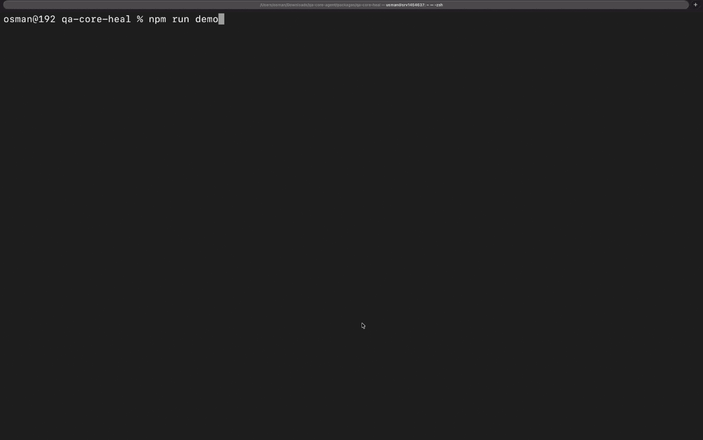

# qa-core-heal

Self-healing for broken Playwright locators. Deterministic engine, reviewable diffs, honest refusals.

Your UI changed, your locators broke, your suite went red. qa-core-heal probes the live page, finds the same elements through Playwright's own locator ladder (role, label, placeholder, text, testid), and rewrites the broken locators in your specs and page objects. Every change is shown as a diff before it is applied, verified by re-running the test after, and logged.



## The numbers

Measured on 6 public eval suites in this repo (55 locators, 28 deliberately broken), Playwright 1.60:

| | |
|---|---|
| Healable breaks fixed and verified by a passing re-run | 22 / 22 |
| Unhealable breaks correctly refused instead of guessed | 6 / 6 |
| Wrong heals (locator rewritten to the wrong element) | 0 |
| Determinism | two full runs, byte-identical results |

Run them yourself: `npm run evals`. The fixtures, expected results, and scoring rules are all in `evals/`.

## Why deterministic matters

The heal engine contains no LLM call. Same page, same broken locator, same replacement, every time, provable by hashing the output. No API key, no cost per heal, no "it worked yesterday". When heal cannot find the element with certainty, it refuses and tells you why, because a wrong locator that passes today is worse than a red test you can see.

## Install

As a dependency of your test project (once the package is on npm):

```
npm install qa-core-heal
npx playwright install chromium   # one time, if you do not already have it
```

From source, using a clone or download of this folder:

```
npm install
npx playwright install chromium                 # macOS and Windows
npx playwright install --with-deps chromium     # Linux: also installs the system libraries Chromium needs
npm run demo
```

`npm run demo` builds the package, runs the bundled example suite with its deliberately broken locators to show the failures, then runs heal in dry-run mode and prints the proposed fixes. On Linux the plain `npx playwright install chromium` downloads the browser but tests will fail at launch until the system libraries are installed, which is what `--with-deps` does.

## Use

```
npx qa-core-heal tests/checkout.spec.ts --base-url http://localhost:3000 --dry-run
```

From a source checkout, run `npm run build` once, then use `node dist/cli.js` in place of `npx qa-core-heal`.

Dry-run prints the proposed heals: file, line, old locator, new locator, and the cascade level each resolved at. Drop `--dry-run` to apply: the CLI prints the full proposed diff, asks for confirmation (pass `--yes` for CI and scripts), re-runs the healed specs to verify (on by default, `--no-verify` to skip), and appends every applied heal to `.qa-core/heal-log.jsonl` with a verified flag. Add `--json` for machine-readable output (CI friendly, byte-stable).

Optional `qa-core.config.json` in your repo root sets baseUrl, test dir, allowed locator levels, page object handling, and auth via a Playwright storage state file. Full schema in `skill/references/config.md`.

## Use it as a Claude Code skill

The `skill/` folder makes heal a Claude Code skill: Claude detects locator-class failures in your suite, runs heal in dry-run, presents the consolidated diff, applies only what you approve, and never commits. Copy `skill/` into your skills directory or install from the release.

## What heal does not do

Honesty about scope, so you are never surprised:

1. It probes the initial page state. A locator targeting something that only exists after an interaction (a success toast, a post-click message) will look broken to heal. Exclude those or accept the refusal.
2. It cannot see silent positional drift. If a list reorders, `li:nth-child(2)` still resolves, just to a different row, so heal reports it intact. Positional locators are fragile by nature; heal fixes broken ones, it does not audit passing ones.
3. Hash-suffixed generated ids (`#manage-apps-3fc9a1`) heal only when the element offers a second identity: a role, a label, a semantic keyword. If the id was the only identity and it changed, heal refuses rather than guesses.
4. It never commits. Applying approved diffs to your working tree is the maximum action. You review, you commit.
5. Pages that mutate identity attributes faster than a probe can read them get a deterministic refusal, not a guess: evidence that changes while heal is looking at it is discarded, and if nothing stable confirms the match the locator is reported unhealable with an instability reason.

## How it chooses replacements

A fixed cascade in Playwright's recommended stability order: role with accessible name, label, placeholder, text, alt, title, testid, then CSS and XPath as last resorts you can forbid entirely in config. If multiple elements match, the result is flagged ambiguous and refused for auto-apply. The full ladder is documented in `skill/references/locator-strategy.md`.

## License and contributing

MIT. Issues and eval-suite contributions welcome, especially broken-locator patterns from real projects that heal should handle or honestly refuse.

Built by [Muhammad Usman](https://sardarusmanjutt.com), part of the QA-Core agentic testing project.
